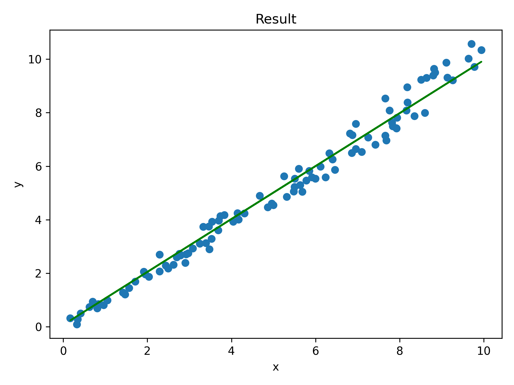
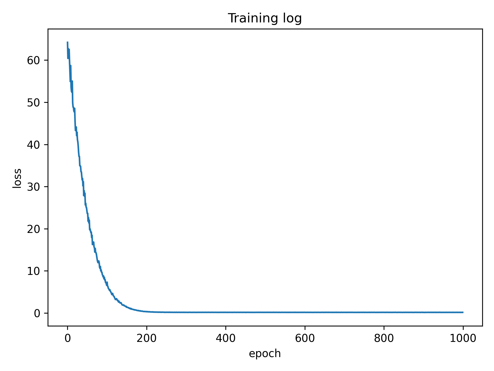

# Mini Cluster Manager

This mini cluster manager is a command-line-interface (CLI) to manage a cluster of docker containers like the official docker CLI. This mini cluster manager is just a demo, it's not suitable for production!

Only container with a name starts with `my_task_container` will be managed by this mini cluster manager to prevent unintended result on your other important containers.

A help option is built in, you can try `python CM.py --help` or `python CM.py delete --help` for specific command.

All demo command is executed in the root directory of this project.

## I. Setup

1. create and activate conda environment

```bash
conda create -p ./env python=3.10
conda activate ./env
```
2. install requirements

```bash
conda install pip
pip install torch==2.2.0 torchvision==0.17.0 torchaudio==2.2.0 --index-url https://download.pytorch.org/whl/cpu
pip install -r requirements.txt
```

3. build docker image

```bash
docker build . --tag my_task_image:latest
```

## II. Overview

### 1. File Structure

The main entry is `CM.py`, most of the functionality code in in `cluster_manager.py`. Client code to be executed in containers is in `task2.py` and `task3.py`. `data` will be mounted by all container as a shared data volume.


### 2. Command Help

A help option is built in, you just need to run `python CM.py --help`

```bash
$ python CM.py --help
Usage: CM.py [OPTIONS] COMMAND [ARGS]...

Options:
  --help  Show this message and exit.

Commands:
  create  Create a certain number of containers
  delete  Delete containers, you can delete all containers or a specific...
  list    List all containers
  run     Run a cmd in a container, without giving a name of a specific...
  stop    Stop containers, you can stop all containers or a specific one...
  task2   This is a parallel data processing task in which 4 containers...
  task3   This is a linear regression implemented in Pytorch
```

To get details of each command, you can run `python CM.py delete --help`

```bash
$ python CM.py delete --help
Usage: CM.py delete [OPTIONS]

  Delete containers, you can delete all containers or a specific one by name
  Running containers will not be deleted

Options:
  --name TEXT  name of the container to delete, delete all if empty
  --help       Show this message and exit.
```

## III. Command Detail

### 1. create

This command will create a certain number of containers without starting them.

#### 1) command help

```bash
$ python CM.py create --help
Usage: CM.py create [OPTIONS] NUMBER

  Create a certain number of containers

Options:
  --help  Show this message and exit.
```

#### 2) demos

create 4 containers:

```bash
$ python CM.py create 4
created 4 containers
container 1 : my_task_container_0
container 2 : my_task_container_1
container 3 : my_task_container_2
container 4 : my_task_container_3
```

create 4 containers more:

```bash
$ python CM.py create 4
created 4 containers
container 1 : my_task_container_4
container 2 : my_task_container_5
container 3 : my_task_container_6
container 4 : my_task_container_7
```

validate by official docker CLI:
```bash
$ docker ps --all
CONTAINER ID   IMAGE           COMMAND       CREATED         STATUS    PORTS     NAMES
3f345d989cfb   my_task_image   "/bin/bash"   2 minutes ago   Created             my_task_container_7
4e6a7e256324   my_task_image   "/bin/bash"   2 minutes ago   Created             my_task_container_6
3d5621f8f54a   my_task_image   "/bin/bash"   2 minutes ago   Created             my_task_container_5
256713b106be   my_task_image   "/bin/bash"   2 minutes ago   Created             my_task_container_4
625e29bd8481   my_task_image   "/bin/bash"   2 minutes ago   Created             my_task_container_3
6703341107ec   my_task_image   "/bin/bash"   2 minutes ago   Created             my_task_container_2
2585bcfbb558   my_task_image   "/bin/bash"   2 minutes ago   Created             my_task_container_1
c7ad5ea87c70   my_task_image   "/bin/bash"   2 minutes ago   Created             my_task_container_0
```

### 2. list

#### 1) command help

```bash
$ python CM.py list --help
Usage: CM.py list [OPTIONS]

  List all containers

Options:
  --help  Show this message and exit.
```

#### 2) demos

list all containers
```bash
$ python CM.py list
There are 2 containers:
container 1 : {'NAME': 'my_task_container_3', 'IMAGE': 'sha256:af8b5945f995cfe3880de2417140393ef9f41f834d4d51479ee3cec1666f26bf', 'STATUS': 'running', 'CREATED': '2024-02-15T02:59:35.084325603Z', 'CONTAINER ID': '81c10da0ae3f1365ce05068dfe6674d1b1e29e7b7616982707c3698f8d2ee44c'}
container 2 : {'NAME': 'my_task_container_0', 'IMAGE': 'sha256:af8b5945f995cfe3880de2417140393ef9f41f834d4d51479ee3cec1666f26bf', 'STATUS': 'running', 'CREATED': '2024-02-15T02:51:04.627448853Z', 'CONTAINER ID': '7a05a34e8fd3e61ea16acf6a36ac888bcf082f650bf15c4d1c64729222d49580'}
```

validate by official docker CLI:
```bash
$ docker ps --all
CONTAINER ID   IMAGE           COMMAND       CREATED          STATUS         PORTS     NAMES
81c10da0ae3f   my_task_image   "/bin/bash"   2 minutes ago    Up 2 minutes             my_task_container_3
7a05a34e8fd3   my_task_image   "/bin/bash"   10 minutes ago   Up 4 minutes             my_task_container_0
```

### 3. delete

This command will delete not running containers. You can give the name of a specific container to delete or delete all containers without giving a specific name.

Try to delete a non-exist or running container will return prompt.

#### 1) command help

```bash
$ python CM.py delete --help
Usage: CM.py delete [OPTIONS]

  Delete containers, you can delete all containers or a specific one by name
  Running containers will not be deleted

Options:
  --name TEXT  name of the container to delete, delete all if empty
  --help       Show this message and exit.
```

#### 2) demos

try to delete a container not exists:
```bash
$ python CM.py delete --name no_exist_container
no container names no_exist_container
```

delete a specific not running container
```bash
# docker ps --all before delete
$ docker ps --all
CONTAINER ID   IMAGE           COMMAND       CREATED              STATUS    PORTS     NAMES
a6331591601c   my_task_image   "/bin/bash"   About a minute ago   Created             my_task_container_2
0f590263e66d   my_task_image   "/bin/bash"   About a minute ago   Created             my_task_container_1
7a05a34e8fd3   my_task_image   "/bin/bash"   About a minute ago   Created             my_task_container_0
```

```bash
# delete my_task_container_2
$ python CM.py delete --name my_task_container_2
deleted container my_task_container_2
```

```bash
# docker ps --all after delete
$ docker ps --all
CONTAINER ID   IMAGE           COMMAND       CREATED         STATUS    PORTS     NAMES
0f590263e66d   my_task_image   "/bin/bash"   3 minutes ago   Created             my_task_container_1
7a05a34e8fd3   my_task_image   "/bin/bash"   3 minutes ago   Created             my_task_container_0
```

delete a specific running container
```bash
# try to delete my_task_container_0
$ python CM.py delete --name my_task_container_0
container my_task_container_0 is running, please stop it before delete it!
```

delete all not running containers:
```bash
# docker ps --all before delete
$ docker ps --all
CONTAINER ID   IMAGE           COMMAND       CREATED          STATUS          PORTS     NAMES
81c10da0ae3f   my_task_image   "/bin/bash"   32 seconds ago   Up 13 seconds             my_task_container_3
ff4d973d461d   my_task_image   "/bin/bash"   32 seconds ago   Created                   my_task_container_2
0f590263e66d   my_task_image   "/bin/bash"   9 minutes ago    Created                   my_task_container_1
7a05a34e8fd3   my_task_image   "/bin/bash"   9 minutes ago    Up 3 minutes              my_task_container_0
```

```bash
# delete all not running containers
$ python CM.py delete
deleted all not running containers: ['my_task_container_2', 'my_task_container_1']
```

```bash
# docker ps --all after delete
$ docker ps --all
CONTAINER ID   IMAGE           COMMAND       CREATED          STATUS         PORTS     NAMES
81c10da0ae3f   my_task_image   "/bin/bash"   2 minutes ago    Up 2 minutes             my_task_container_3
7a05a34e8fd3   my_task_image   "/bin/bash"   10 minutes ago   Up 4 minutes             my_task_container_0
```

### 4. stop

This command will stop a specific container with a container name given or stop all running containers without a name given.

Try to stop a non-exist or not running container will return prompt.

#### 1) command help
```bash
$ python CM.py stop --help
Usage: CM.py stop [OPTIONS]

  Stop containers, you can stop all containers or a specific one by name

Options:
  --name TEXT  name of the container to stop, stop all if empty
  --help       Show this message and exit.
```

#### 2) demos

stop a not running container:
```bash
$ python CM.py stop --name my_task_container_1
container my_task_container_1 is not running
```

stop a non-exist container:
```
$ python CM.py stop --name my_task_container_100
no container names my_task_container_100
```

stop a specific running container:
```bash
# docker ps --all before stop
$ docker ps --all
CONTAINER ID   IMAGE           COMMAND       CREATED          STATUS          PORTS     NAMES
8361d19b5137   my_task_image   "/bin/bash"   6 seconds ago    Created                   my_task_container_2
0214325296d4   my_task_image   "/bin/bash"   6 seconds ago    Created                   my_task_container_1
81c10da0ae3f   my_task_image   "/bin/bash"   9 minutes ago    Up 9 minutes              my_task_container_3
7a05a34e8fd3   my_task_image   "/bin/bash"   18 minutes ago   Up 12 minutes             my_task_container_0
```

```bash
# stop my_task_container_0
$ python CM.py stop --name my_task_container_0
stopped container my_task_container_0
```

```bash
# docker ps --all after stop
$ docker ps --all
CONTAINER ID   IMAGE           COMMAND       CREATED          STATUS                        PORTS     NAMES
8361d19b5137   my_task_image   "/bin/bash"   6 minutes ago    Created                                 my_task_container_2
0214325296d4   my_task_image   "/bin/bash"   6 minutes ago    Created                                 my_task_container_1
81c10da0ae3f   my_task_image   "/bin/bash"   15 minutes ago   Up 15 minutes                           my_task_container_3
7a05a34e8fd3   my_task_image   "/bin/bash"   24 minutes ago   Exited (137) 30 seconds ago             my_task_container_0
```

stop all running containers:
```bash
# docker ps --all before stop
$ docker ps --all
CONTAINER ID   IMAGE           COMMAND       CREATED          STATUS          PORTS     NAMES
8361d19b5137   my_task_image   "/bin/bash"   7 minutes ago    Created                   my_task_container_2
0214325296d4   my_task_image   "/bin/bash"   7 minutes ago    Created                   my_task_container_1
81c10da0ae3f   my_task_image   "/bin/bash"   16 minutes ago   Up 16 minutes             my_task_container_3
7a05a34e8fd3   my_task_image   "/bin/bash"   25 minutes ago   Up 5 seconds              my_task_container_0
```
```bash
# stop all running containers
$ python CM.py stop
stopped all running containers: ['my_task_container_3', 'my_task_container_0']
```
```bash
# docker ps --all after stop
$ docker ps --all
CONTAINER ID   IMAGE           COMMAND       CREATED          STATUS                        PORTS     NAMES
8361d19b5137   my_task_image   "/bin/bash"   8 minutes ago    Created                                 my_task_container_2
0214325296d4   my_task_image   "/bin/bash"   8 minutes ago    Created                                 my_task_container_1
81c10da0ae3f   my_task_image   "/bin/bash"   18 minutes ago   Exited (137) 53 seconds ago             my_task_container_3
7a05a34e8fd3   my_task_image   "/bin/bash"   27 minutes ago   Exited (137) 43 seconds ago             my_task_container_0
```

### 5. run

This command will execute a command in a container. You can give a specific name of container to execute your command or execute your command in a new container without giving a container name.

Try to execute a command in a non-exist container will return a prompt.

#### 1) command help

```bash
$ python CM.py run --help
Usage: CM.py run [OPTIONS]

  Run a cmd in a container, without giving a name of a specific container, a
  new container will be created

Options:
  --name TEXT  the name of container to run the command, empty for creating a
               new container to run the command
  --cmd TEXT   the command to run
  --help       Show this message and exit.
```

#### 2) demos

try to execute command in a non-exist container:
```
$ python CM.py run --name no_exist_container --cmd "echo Hello!"
no container name no_exist_container
```

execute command in a exist container:
```bash
$ python CM.py run --name my_task_container_0 --cmd "ls"
command output:
data
requirements.txt
task2.py
task3.py
```

execute command in a new container:
```bash
$ python CM.py run --cmd "ls -l"
command output:
total 16
drwxrwxr-x 2 1000 1000 4096 Feb 14 15:22 data
-rw-rw-r-- 1 root root  596 Feb 14 14:20 requirements.txt
-rw-rw-r-- 1 root root  748 Feb 14 14:12 task2.py
-rw-rw-r-- 1 root root 1874 Feb 14 15:20 task3.py
```

## IIII. Task2

In task2, the Cluster Manager will generate a dataset (100000 random float numbers) and save it to shared data volume `data/data.csv`, then execute parallel data processing code in 4 containers asynchronously. Each container will processing 1/4 of the total data according to the `idx` parameter passed to it.

### 1) command help

```bash
$ python CM.py task2 --help
Usage: CM.py task2 [OPTIONS]

  This is a parallel data processing task in which 4 containers will execute
  asynchronously

Options:
  --help  Show this message and exit.
```

### 2) demo

```bash
$ python CM.py task2
result from container 1 : {'container index': 0, 'sum': 12477.578374687431, 'average': 0.49910313498749725, 'max': 0.9999476558599651, 'min': 3.207239879099433e-05, 'standard deviation': 0.2874527060982726}
result from container 2 : {'container index': 1, 'sum': 12523.100913155728, 'average': 0.5009240365262291, 'max': 0.9999590895649356, 'min': 1.3387063275693833e-06, 'standard deviation': 0.28983620477434674}
result from container 3 : {'container index': 2, 'sum': 12547.010931670344, 'average': 0.5018804372668138, 'max': 0.9999903582090628, 'min': 8.96172297106812e-05, 'standard deviation': 0.28821294618275417}
result from container 4 : {'container index': 3, 'sum': 12487.209588502163, 'average': 0.4994883835400865, 'max': 0.9998250345346854, 'min': 1.9170983271976638e-05, 'standard deviation': 0.28762140898281335}
```

### 3) Brief Of Coding

generate data and save it to data volume
```python
data = numpy.random.random(100000)
csv_path = self.data_path + "/data.csv"
numpy.savetxt(csv_path, data, delimiter=',')
```

create 4 container and execute data processing simultaneously
```python
def raw_run(self, id: str, cmd: str):
    self.cli.api.start(id)
    ids = self.cli.api.exec_create(id, cmd=cmd)
    res = self.cli.api.exec_start(ids, tty=True)
    return res.decode()

async def async_task2(self, ids: list, csv_path: str):
    loop = asyncio.get_event_loop()
    tasks = []
    for i in range(4):
        tasks.append(loop.run_in_executor(None,
                                          self.raw_run,
                                          ids[i],
                                          f"python task2.py --file {csv_path} --idx {i}"))
    tasks_res = await asyncio.gather(*tasks)
    return tasks_res
cons = self.create(4)
ids = []
for con in cons:
    idx = self.search_by_name(self.containers, con)
    ids.append(self.containers[idx]["CONTAINER ID"])
res = asyncio.get_event_loop().run_until_complete(self.async_task2(ids, csv_path))
```

## IIII. Task3

In Task3, the Cluster Manager will generate a dataset and save it to shared volume `data/data.ptd`, then execute a linear regression algorithm in a container to generate a result image under shared volume `data/result.png` and a training log image `data/train.png`

### 1) command help
```
$ python CM.py task3 --help
Usage: CM.py task3 [OPTIONS]

  This is a linear regression implemented in Pytorch

Options:
  --help  Show this message and exit.
```

### 2) demos

```bash
$ python CM.py task3
epoch 1, loss 64.22145080566406
epoch 2, loss 60.4116096496582
epoch 3, loss 62.72115707397461
epoch 4, loss 61.54668045043945
epoch 5, loss 62.55024719238281
epoch 6, loss 59.899879455566406
epoch 7, loss 57.47677230834961
epoch 8, loss 54.91875457763672
epoch 9, loss 58.71295166015625
epoch 10, loss 53.631195068359375
epoch 100, loss 6.551596641540527
epoch 200, loss 0.2968377470970154
epoch 300, loss 0.1470317840576172
epoch 400, loss 0.14722920954227448
epoch 500, loss 0.13368774950504303
epoch 600, loss 0.14912699162960052
epoch 700, loss 0.13571767508983612
epoch 800, loss 0.14016148447990417
epoch 900, loss 0.14540353417396545
epoch 1000, loss 0.13645939528942108
saved training log to ./data/train.png
saved result to ./data/result.png
```



### 3) Brief Of Coding

generate data in Cluster Manager and save data to shared data volume

```python
data_size = 100000
x_data = torch.linspace(0, 10, data_size)
y_data = torch.linspace(0, 10, data_size)
y_data = y_data * ((torch.rand(data_size) - 0.5) / 5 + 1) + \
    ((torch.rand(data_size) - 0.5) / 2)
torch.save({"x_data": x_data.reshape(data_size, 1),
            "y_data": y_data.reshape(data_size, 1)},
            "data/data.ptd")
res = self.run_cmd("", "python task3.py --file \"data/data.ptd\"")
```

load data from data volume in container

```python
parser = argparse.ArgumentParser(description='Client for Task 2')
parser.add_argument('--file', type=str,
                    help='file path of data')
args = parser.parse_args()
data = torch.load(args.file)
```

Linear regression is implemented in `task3.py` with Pytorch.
